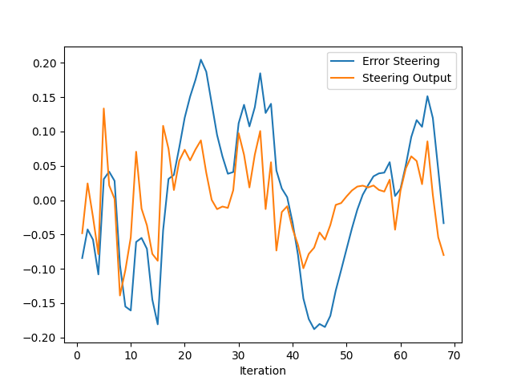
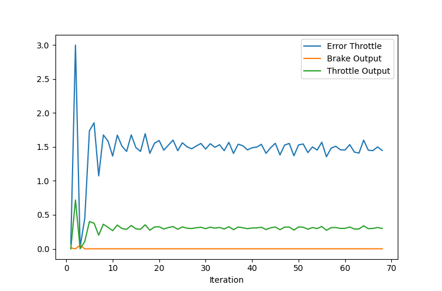

# Control and Trajectory Tracking for Autonomous Vehicle

# Proportional-Integral-Derivative (PID)

In this project, you will apply the skills you have acquired in this course to design a PID controller to perform vehicle trajectory tracking. Given a trajectory as an array of locations, and a simulation environment, you will design and code a PID controller and test its efficiency on the CARLA simulator used in the industry.

### Installation

Run the following commands to install the starter code in the Udacity Workspace:

Clone the <a href="https://github.com/udacity/nd013-c6-control-starter/tree/master" target="_blank">repository</a>:

`git clone https://github.com/udacity/nd013-c6-control-starter.git`

## Run Carla Simulator

Open new window

- `su - student`
  // Will say permission denied, ignore and continue
- `cd /opt/carla-simulator/`
- `SDL_VIDEODRIVER=offscreen ./CarlaUE4.sh -opengl`

## Compile and Run the Controller

Open new window

- `cd nd013-c6-control-starter/project`
- `./install-ubuntu.sh`
- `cd pid_controller/`
- `rm -rf rpclib`
- `git clone https://github.com/rpclib/rpclib.git`
- `cmake .`
- `make` (This last command compiles your c++ code, run it after every change in your code)

## Testing

To test your installation run the following commands.

- `cd nd013-c6-control-starter/project`
- `./run_main_pid.sh`
  This will silently fail `ctrl + C` to stop
- `./run_main_pid.sh` (again)
  Go to desktop mode to see CARLA

If error bind is already in use, or address already being used

- `ps -aux | grep carla`
- `kill id`

## Project Instructions

In the previous project you built a path planner for the autonomous vehicle. Now you will build the steer and throttle controller so that the car follows the trajectory.

You will design and run the a PID controller as described in the previous course.

In the directory [/pid_controller](https://github.com/udacity/nd013-c6-control-starter/tree/master/project/pid_controller) you will find the files [pid_controller.cpp](https://github.com/udacity/nd013-c6-control-starter/blob/master/project/pid_controller/pid_controller.cpp) and [pid_controller.h](https://github.com/udacity/nd013-c6-control-starter/blob/master/project/pid_controller/pid_controller.h). This is where you will code your pid controller.
The function pid is called in [main.cpp](https://github.com/udacity/nd013-c6-control-starter/blob/master/project/pid_controller/main.cpp).

### Step 1: Build the PID controller object

Complete the TODO in the [pid_controller.h](https://github.com/udacity/nd013-c6-control-starter/blob/master/project/pid_controller/pid_controller.h) and [pid_controller.cpp](https://github.com/udacity/nd013-c6-control-starter/blob/master/project/pid_controller/pid_controller.cpp).

Run the simulator and see in the desktop mode the car in the CARLA simulator. Take a screenshot and add it to your report. The car should not move in the simulation.

### Step 2: PID controller for throttle:

1. In [main.cpp](https://github.com/udacity/nd013-c6-control-starter/blob/master/project/pid_controller/main.cpp), complete the TODO (step 2) to compute the error for the throttle pid. The error is the speed difference between the actual speed and the desired speed.

Useful variables:

- The last point of **v_points** vector contains the velocity computed by the path planner.
- **velocity** contains the actual velocity.
- The output of the controller should be inside [-1, 1].

2. Comment your code to explain why did you computed the error this way.

3. Tune the parameters of the pid until you get satisfying results (a perfect trajectory is not expected).

### Step 3: PID controller for steer:

1. In [main.cpp](https://github.com/udacity/nd013-c6-control-starter/blob/master/project/pid_controller/main.cpp), complete the TODO (step 3) to compute the error for the steer pid. The error is the angle difference between the actual steer and the desired steer to reach the planned position.

Useful variables:

- The variable **y_points** and **x_point** gives the desired trajectory planned by the path_planner.
- **yaw** gives the actual rotational angle of the car.
- The output of the controller should be inside [-1.2, 1.2].
- If needed, the position of the car is stored in the variables **x_position**, **y_position** and **z_position**

2. Comment your code to explain why did you computed the error this way.

3. Tune the parameters of the pid until you get satisfying results (a perfect trajectory is not expected).

### Step 4: Evaluate the PID efficiency

The values of the error and the pid command are saved in thottle_data.txt and steer_data.txt.
Plot the saved values using the command (in nd013-c6-control-refresh/project):

```
python3 plot_pid.py
```

You might need to install a few additional python modules:

```
pip3 install pandas
pip3 install matplotlib
```

<br/>
<br/>

# Results

<b>Add the plots to your report and explain them </b>

The first plot shows the steering error and steering output. Most of the parts, the error curve shows a low oscillation but after 40 to 50 iteration, it shows a deep oscillation then it get back to low.



The second plot the velocity control. The car started from 0 speed, giving the simulation environment it was hard to amintaine constant speed which results in high error throttle.



<b>What is the effect of the PID according to the plots, how each part of the PID affects the control command?</b>

  <br/>
  <b>P:</b> Proportional part - create n output value that is proportional to the current error value -in other word, cross error value- the higher the output yields in higher oscillation.

<b>I:</b> Integral part - Proportional to the duration of the error and the magnitude of the error.

<b>D:</b> Derivative part - calculated by identifying the slope of the error over time and multiplying this rate of change by the derivative gain. This value helps the system stability.
<br/>

<b>How would you design a way to automatically tune the PID parameters?</b>

I would use <b>Twiddle algorithm</b> which always optimize the PID controller parameters.

<b>PID controller is a model free controller, i.e. it does not use a model of the car. Could you explain the pros and cons of this type of controller?</b>

The advantage is It's a simple algorithm that are used to compute outputs, it take no effort to run it on basic platform. While the disadvantage is each step it only use a single refrence point.
